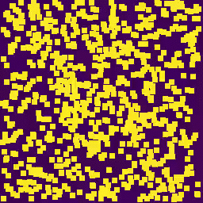

# SmoothLife

"Generalization of Conway's "Game of Life" to a continuous domain - SmoothLife"

Written in Python using `numpy` and explained (hopefully) without too much fancy math.

Also checkout the [Android version](https://github.com/duckythescientist/SmoothLifeAndroid) (available on the [Play Store](https://play.google.com/store/apps/details?id=ninja.duck.smoothlife))



So far I have the discrete time step version working well. I wasn't happy with the look of the continuous time solution, but it's in the source comments if you want to poke at it.

[See here](https://arxiv.org/abs/1111.1567) for the original paper.


## What is this "Game of Life"?

There is [a bunch of information on the internet](http://lmgtfy.com/?q=Conway%27s+game+of+life) about Conway's Game of Life (GoL), and if you haven't heard of it before, I suggest you learn about it because it'll make the rest of this make a lot more sense.

I'll start with a quick recap. GoL is a specific cellular automata. Imagine a 2D grid of cells (think graph paper). Each cell is either alive or dead at any moment in time. At each next moment in time, a cell can change state or stay the same. Because this is a 2D square grid. Each cell has a total of 8 neighbor cells. If a cell is alive and it has 2 or 3 live neighbors, it will stay alive. If it has fewer than 2 live neighbors, it'll die off of loneliness. If it has more than 3 live neighbors, it'll die off from being overcrowded. If a dead cell has exactly 3 live neighbors, it will come alive.


There is _quite a lot_ of interesting behavior that can come of this very simple rule set.

Another of my GoL projects can be found [here - GoL in 9 lines of horribly obfuscated C](https://github.com/duckythescientist/obfuscatedLife).

## SmoothLife

GoL operates on a discrete grid and discrete time steps. Cells have very specific boundaries and they are blocky. Each "moment" in time is a hard transition from the previous state to the next state. What if there were a way to make GoL continuous or smooth.

Enter SmoothLife. [This paper](https://arxiv.org/abs/1111.1567) came up with a set of equations to convert GoL to a continuous time/space domain. 

I'll cover mostly the continuous space aspect of this and hopefully do it in a way that doesn't require much math. Not everyone intuitively understand integrals and solutions to differential equations. 

[Here](https://0fps.net/2012/11/19/conways-game-of-life-for-curved-surfaces-part-1/) is a great post that explains this but goes heavy on the math. If you can stomach integrals and diffeq, I highly recommend it.

### Continuous Space

Instead of individual cells that are alive (1) or dead (0), we can represent this by a smooth area of values that range between 0.0 and 1.0. Consider floats instead of ints. However, to actually have a smooth space, we'd have to have an infinitely large number of floats for our 2D gridspace. Computers don't have infinite memory _yet_, so we need to limit this. Instead, we'll still use a grid but have the size of a GoL cell be larger than a single grid element. Let's redefine a "cell" as the collection of grid elements within a small area. Get some really fine grid paper and set your coffee mug down on it. The cell is the overall area of the mug. It's made up of multiple different grid elements. You can set your coffee mug down anywhere, though, so individual elements are not assigned to specific cells. Hopefully this'll make more sense soon.

With GoL as before, we need to know if a cell is alive or dead. But because we can't directly calculate cells, we have to approximate. Let's instead let a cell be the average of the grid elements within its radius. (That's the `m` integral in the paper.) We do our calculations one grid element at a time, though, so what we have to do is for every single grid element, look at all of the other grid elements within the distance of the radius of a cell. Take all of those elements and average them out. That's the aliveness value.

### Smoothness

This is all fine and dandy, but it's still rather blocky. So far, the decision as to whether a grid element is within or outside of a radius calculation would be exactly one or the other. Let's make our radius calculations fuzzy. A general type of function that let's us smoothly transition between 0 and 1 is a sigmoid function. Sigmoid meaning "S" shaped. Specifically, let's use the [Logistic Function](https://en.wikipedia.org/wiki/Logistic_function). We'll use this to "blur" the edges of our cell circles. 

Here's an example of the type of blur that I'm talking about. It's not a hard circle of a coffee stain from a mug but a smooth transition.


For those of you following along with code, this is `logistic2d((128, 128), 30, roll=False, logres=0.5)`

So, overall for the aliveness score, we have:

```
For each element (assume a cell centered here):
    Look at other elements:
        Put the distance between them into a logistic function
        If the distance is really small, the logistic will be 1
        If the distance is really large, the logistic will be 0
        If the distance is close to the radius, it will be smoothly somewhere between 0 and 1
        Multiply the element aliveness by the logistic
        And add that to the sum that for the average aliveness of the cell
```

### Neighbors

We need a way to count the aliveness of neighbors, but we can do a similar thing. Let's do the same type of calculation but instead look at all grid elements within 3*(cell radius) and call that average value the neighbor aliveness. This is the `n` integral in the paper.

However, this includes both the neighbors and the cell itself. To fix this, we can just subtract our `m` from our `n` -- subtract the local fuzzy circle from the neighbor fuzzy circle and get a fuzzy doughnut. 


And to make things easier, let's scale this number from 0.0 to 1.0 with 0.0 being very dead neighbors to 1.0 being every neighbor grid element is as alive as possible.

### Transition Functions

We still have some discreteness that would be best made smooth. In GoL, the decision for a cell to be alive or dead next generation is with hard rules. Comparison with 2 and 3. Let's apply the logistic function to this transition. 

Using the values from the paper, use a logistic around 0.5 to determine aliveness of the local cell. If the local cell is alive, if the neighbors are between 0.267 and 0.445 then keep the cell alive. If the local cell is dead and the neighbors are between 0.278 and 0.365 then make the cell alive. These transitions are fuzzy and all done with logistics and linear interpolation. 

[This article](https://0fps.net/2012/11/19/conways-game-of-life-for-curved-surfaces-part-1/) probably did a better job of explaining it, and he used pictures, but he went deeper into the math. 


### Smooth Time Steps

I'm not happy with this yet. I have some commented code, and there is a bunch of implementations (C/BASIC/GLShaders), but I didn't like the look of how mine was working. I'm open to ideas.

Currently, this is still a non-smooth thing in my SmoothLife. Time steps are discrete.

-------------------------

Alright, so that covers most of the theory. Now time for some speedups.

## Kernel Convolution

### What?

Before, when we needed to calculate the aliveness for a grid element, we would look at all of the other grid elements, multiply them by the logistic function of the distance, and add them up. One way of doing this is:

```
Precompute the logistic function
Put that into a matrix
For every element on the grid:
    Lay that matrix on the grid
    Piecewise multiply each element with the logistic matrix
    Add up the products
    Use that for the average aliveness of the neighbor area
    Move to the next element on the grid and continue...
```

This operation is known as a [kernel convolution](https://en.wikipedia.org/wiki/Kernel_(image_processing)#Convolution). In this example, the logistic function of distances is our kernel. Kernel convolutions are extraordinarily important for signal and image processing.

But, it's really slow.

### Must Go Faster

Think about it, for an n·n grid, we need an n·n kernel. Then for every element in the grid (n·n elements), we have to do n·n multiplications for a total of n^4 operations (`O(n⁴)` for those of you compsci people following along).

There must be a better way.

### Fourier Transforms

Here comes some math. I'll cover overall ideas, so don't get bogged down. Let `G` be our grid and `K` be our kernel. To determine the aliveness, we needed to perform `G∗K` where `∗` is the convolution operator.

There is a ~~magic~~ fancy operation called a Fourier transform. There is both a forward and an inverse version. For this, let's call the Fourier transform `F(x)` and the inverse transform `F⁻¹(x)`. Also, it's helpful to know that `F(F⁻¹(x)) == F⁻¹(F(x)) == x` meaning that you can use the inverse transform to get back.

Fourier transforms convert things from a time or space domain into a frequency domain. Don't worry if that doesn't make sense. Fourier transforms let us represent data in a very different way without destroying any of the data.

Convolution in the time/space domain (like we were doing before) can be done as multiplication in the frequency domain. (`·` is piecewise multiplication.)

`G∗K == F⁻¹( F(G)·F(K) )`

If we use a Fast Fourier Transform (FFT), this gives us a lot of speedup. For you compsci people, the FFT of an n·n grid can be done in `O(n²·log(n))` operations which gives us the overall bound for convolution which is soooooo much better than the `O(n⁴)` of before.


## Running

### Requirements

* Python 3 (2.7+ may work, but shame on you for using deprecated software)
* `numpy`
* `matplotlib`
* `python3-tk`

`apt install python3 python3-tk python3-pip`

`pip3 install numpy matplotlib`

### Running

`python3 ./smoothlife.py`

There are a bunch of things (some obvious, some not) in the source that you can change for different behavior/colors/sizes.


## Other Things

Comments? Suggestions? Corrections?
